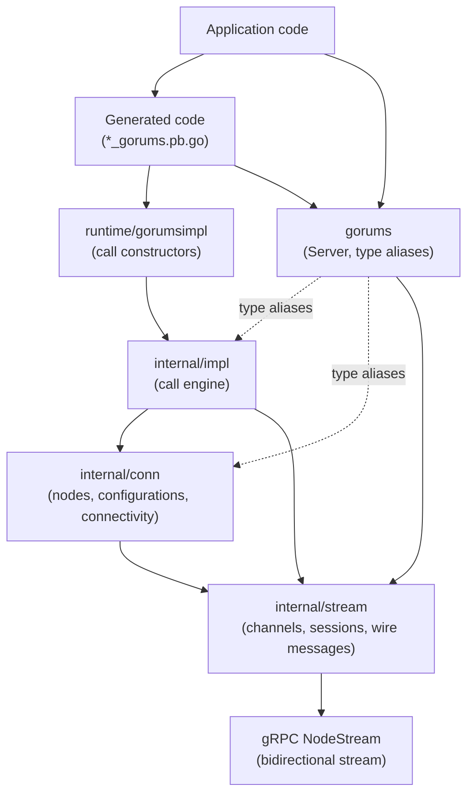
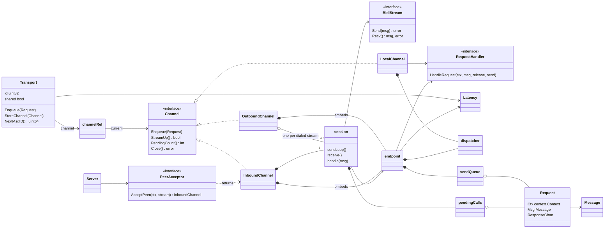
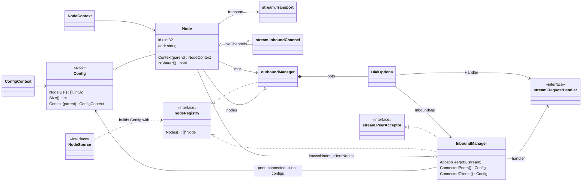
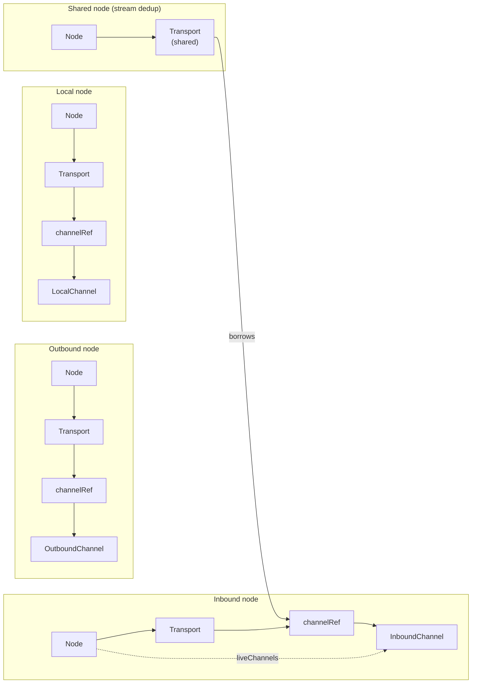
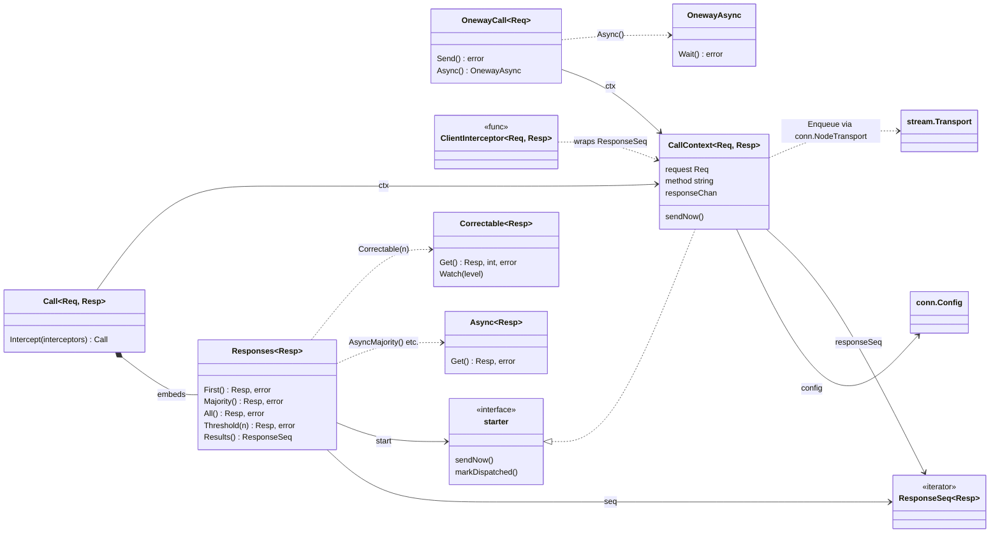
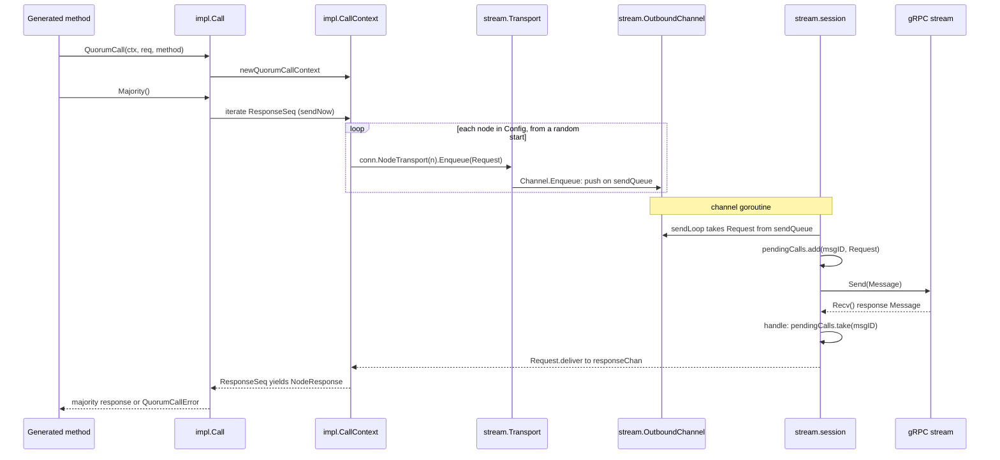
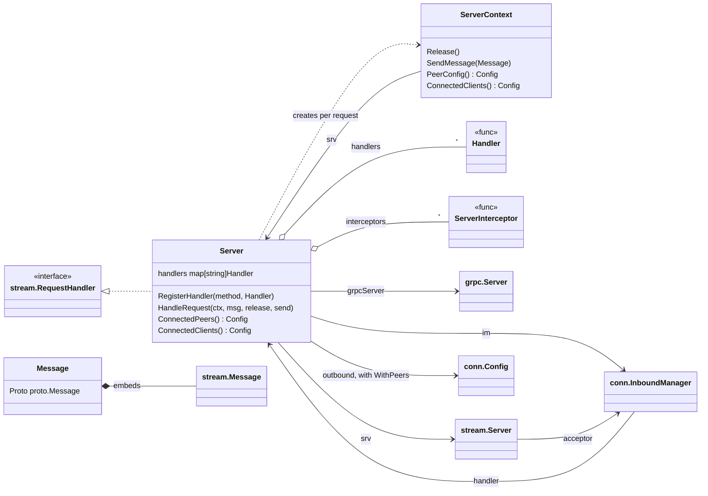
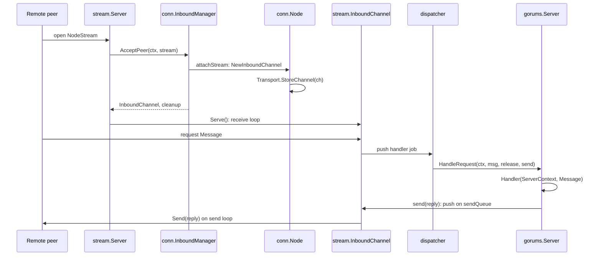

# Developer Guide

The repository contains two main components located in `cmd/protoc-gen-gorums`:

* **dev:** Contains static code and code generated by templates.
  In other words, this is the code that the `protoc-gen-gorums` compiler will output.
  All files that are not prefixed by `zorums*` and do not end in `_test.go` get bundled into `template_static.go`.
* **gengorums:** Contains the code for the `protoc-gen-gorums` compiler, as well as templates.

## Workflow and File Endings

1. **Template Changes:** Changes to generated code in the `dev/zorums_*_gorums.pb.go` files should be done by editing the various templates in the corresponding `gengorums/template_*.go` file.
   Making changes to the `zorums*` files will be overwritten.
   Note that there is not a one-to-one correspondence for all files.

2. **Static Code File Changes:** Any `.go` file in `dev/` that is not prefixed by `zorums_` and does not end in `_test.go` is treated as static code and bundled into `template_static.go`.
   Currently, `aliases.go` is the only such file, but additional files can be added to the `dev/` directory and they will be included automatically.

### Generated Static Surface and Reserved Identifiers

Every generated `_gorums.pb.go` file embeds a small block of static code taken verbatim from `dev/aliases.go`.
That block currently consists of four type aliases:

```go
type (
    Config        = gorums.Config
    Node          = gorums.Node
    NodeContext   = gorums.NodeContext
    ConfigContext = gorums.ConfigContext
)
```

These aliases make the most commonly used Gorums types available without requiring an explicit `gorums` import in user code.

Each name declared in `aliases.go` (and any other non-ignored file in `dev/`) is also added to the **reserved identifier list**.
The Gorums generator rejects proto files whose messages, enums, or RPC methods use a reserved identifier as their Go name, checking every file of the service's Go package, since such a name collides with the generated alias.

The bundler (`gorums_bundle.go`) discovers reserved identifiers by inspecting `TypesInfo.Defs` for all exported, package-scope declarations in the dev package.
This means that simply declaring a type alias (or any other exported top-level name) in `aliases.go` is sufficient to reserve that name — no extra annotation is needed.

The `TestReservedIdentifiers` test in `gengorums/gorums_bundle_test.go` pins the expected set.
If you add or remove an alias, update that test to match.

Any changes to templates or static code requires the invocation of `make` in order to:

* Bundle the static code into `template_static.go`.
* Rebuild the `protoc-gen-gorums` compiler.
* Update the `zorums_*_gorums.pb.go` files.

See the `Makefile` for more details.
To force compile, e.g. following a `protoc` update, you can use:

```sh
make -B
```

## Testing

Testing the `protoc-gen-gorums` compiler itself can be done by running the command below.
These tests verify that the code generated by the Gorums compiler is correct and stable.

### Default Mode (bufconn)

By default, tests use in-memory bufconn connections:

```sh
make test
```

### Integration Mode (real network)

For end-to-end validation with real TCP connections:

```sh
make integrationtest
```

Or directly:

```sh
go test -tags=integration ./...
```

## Benchmarking

See [benchmarking.md](./benchmarking.md)

## Makefile

Below is a description of the current `Makefile` targets.
The `Makefile` itself also serves as documentation; inspect it for details.

| Target            | Description                                                                                            |
| ----------------- | ------------------------------------------------------------------------------------------------------ |
| `all`             | Builds `dev`, `benchmark`, and compiles tests (default target).                                        |
| `dev`             | Updates `template_static.go` and regenerates generated files from templates.                           |
| `genproto`        | Force-regenerates all protobuf and Gorums files across the repo (dev, benchmark, tests, examples).     |
| `benchmark`       | Compiles the benchmark tool.                                                                           |
| `compiletests`    | Compiles test protos in `internal/tests`.                                                              |
| `tools`           | Installs required tools (`protoc-gen-go`, `protoc-gen-go-grpc`, `stress`, etc.) via `go install tool`. |
| `installgorums`   | Reinstalls the `protoc-gen-gorums` plugin.                                                             |
| `bootstrapgorums` | Bootstraps the plugin when it is not yet installed.                                                    |
| `test`            | Runs all tests (using bufconn by default).                                                             |
| `integrationtest` | Runs integration tests with real TCP connections.                                                      |
| `testrace`        | Runs tests with the race detector enabled.                                                             |
| `benchtest`       | Validates that benchmarks compile and run without error (short runs).                                  |
| `bench`           | Runs benchmarks with proper measurement for performance analysis.                                      |
| `stresstest`      | Runs stress tests (build tag: `stress`) for thorough testing.                                          |
| `modernize`       | Applies `go fix` and `x/tools/modernize@latest` across all workspace modules.                           |
| `goplscheck`      | Fails on gopls diagnostics, including hint-level suggestions, in non-generated Go source.             |
| `lint`            | Runs `golangci-lint` with `.golangci.yml` on all workspace modules, as CI does.                       |
| `deadcode`        | Lists functions unreachable from any main or test; advisory, and run by `lint`.                         |

## Runtime Architecture

The runtime is split into layers, each in its own package.
The diagrams below show the main types of each layer and how they connect.
They omit helper types and most fields and methods; the package doc comments and the source are authoritative.

### Package Layering

Generated code reaches the call engine through `runtime/gorumsimpl`, and application code uses the types that the root `gorums` package re-exports as aliases.
Each internal package depends only on the packages below it.



### Stream Layer (`internal/stream`)

A `Transport` is everything a call needs to reach one node.
It holds a `channelRef`, an atomically replaceable reference to the node's current `Channel`.
There are three channel kinds:

* `OutboundChannel` runs over streams this node dials; it opens a new `session` for each stream and requeues pending calls when a stream is lost, as far as the send queue has space.
* `InboundChannel` runs over one stream that the server accepted; its single `session` ends with the stream.
* `LocalChannel` serves requests in-process through the handler, with no stream.

The two stream channels embed an `endpoint` with the send queue, the request dispatcher, the optional `RequestHandler`, and the `Latency` estimate.
A `session` sends queued requests on its `BidiStream`, records two-way calls in `pendingCalls`, and routes received frames either to a pending call or to the dispatcher.
The dispatcher runs handlers one at a time, in arrival order.
A handler that returns without calling `Release` hands its goroutine to the next queued handler, so a busy stream keeps one goroutine and the stack it has grown; an early `Release` starts the next handler on a new goroutine.
On the server side, `Server.NodeStream` asks a `PeerAcceptor` for the `InboundChannel` of each accepted stream.



### Connectivity Layer (`internal/conn`)

A `Config` is a slice of `*Node`, and each `Node` has a fixed `stream.Transport`.
An `outboundManager` creates and owns the nodes of the configurations built by `NewConfig` and `Config.Extend`.
A server's `InboundManager` owns the nodes for its known peers and for the peer-capable clients that connect to it, and maintains the connected-peer and connected-client configurations.
It implements `stream.PeerAcceptor`, attaching each accepted stream to the matching node.
Both managers implement `nodeRegistry`, which a `NodeSource` uses to build a configuration.



### Node Kinds

A node's kind is set by the transport and channel it is created with.
Calls only ever see the node's transport; the channel behind the transport's `channelRef` may change as streams come and go.

* An outbound node dials its peer and owns an `OutboundChannel`.
* A local node is the server's own node in its peer configuration; it owns a `LocalChannel` that calls the server's handler in-process.
* An inbound node is a known peer or a client of the server; `InboundManager.AcceptPeer` stores an `InboundChannel` in its transport when the peer's stream arrives, and clears it when the last live stream ends.
* A shared node is the higher-ID peer's outbound node under stream deduplication; its shared transport borrows the inbound peer node's `channelRef`, `Latency`, and message-ID generator.



### Call Engine (`internal/impl`)

Each call constructor builds a `CallContext` that holds the request, the target `Config`, the response channel, and the response iterator (`ResponseSeq`).
A quorum call returns a `Call`, which embeds `Responses` and its terminal methods (`First`, `Majority`, `All`, `Threshold`), as well as the `Async` and `Correctable` futures.
A one-way call (`Multicast`, `Unicast`) returns a `OnewayCall`, whose `Send` waits for the send confirmations and whose `Async` returns an `OnewayAsync`.
A `ClientInterceptor` wraps the response iterator and may register per-node request transformations before the call is dispatched.
`CallContext` reaches each node's send path through `conn.NodeTransport`.



### Quorum Call Path

A quorum call is dispatched lazily, on the first iteration of its response iterator, so that interceptors can be registered first.
Each node's channel sends on its own goroutine, and responses are matched to pending calls by message ID.
The fan-out starts at a random node of the configuration and wraps around, so no node is always enqueued last; each node still receives a caller's requests in call order.



### Server Side (`gorums`)

The root `gorums.Server` ties the layers together on the server side.
It registers a `stream.Server` with its gRPC server, uses its `conn.InboundManager` as the server's `stream.PeerAcceptor`, and serves as the `stream.RequestHandler` for inbound streams, for its local node, and for back-channel requests on its outbound peer configuration.
`Server.HandleRequest` creates a `ServerContext` per request and runs the registered `Handler`, wrapped by any `ServerInterceptor`s.
A `gorums.Message` wraps a `stream.Message` together with its decoded proto payload.



### Inbound Request Path

Requests that arrive on one stream run through the handler one at a time until the handler calls `ServerContext.Release` or returns.
A handler's reply is queued on the stream's own channel and sent by its send loop.



## Stream Deduplication Internals

Symmetric stream deduplication makes the lower-ID peer of each pair the only dialer.
The higher-ID peer's outbound node is born shared: it borrows the matching inbound transport when the configuration is created, before the peer has connected.
The borrower cannot dial through a shared transport, so it reports `gorums.ErrStreamDown` while the owner-side stream is unavailable; callers match it with `errors.Is`.
The owner re-establishes a lost stream eagerly with capped backoff from its channel's goroutine, independently of its own sends.

Client-initiated message IDs use the low 63 bits, while server-initiated and shared-call IDs have bit 63 set.
Shared calls use the server-generated ID space so both directions can share one router without sequence-number collisions.
These IDs encode as ten-byte protobuf varints because the high bit is set; the small wire-cost increase is intentional and avoids a second stream or router.

Each channel registers pending calls with an owner token.
Closing a channel cancels or requeues only entries registered by that channel, while full router shutdown cancels all remaining entries during node teardown.

`Node` identity and its transport are fixed at construction; only the channel behind the transport's shared channel reference changes as streams come and go.
A call therefore reads the node's message-ID generator, router, and current channel directly from that fixed transport, with no per-call binding step.

Back-channel request dispatch appends per-message metadata to the incoming context and serializes handlers through the router's FIFO dispatch gate.
This keeps back-channel behavior consistent with ordinary inbound stream dispatch.
