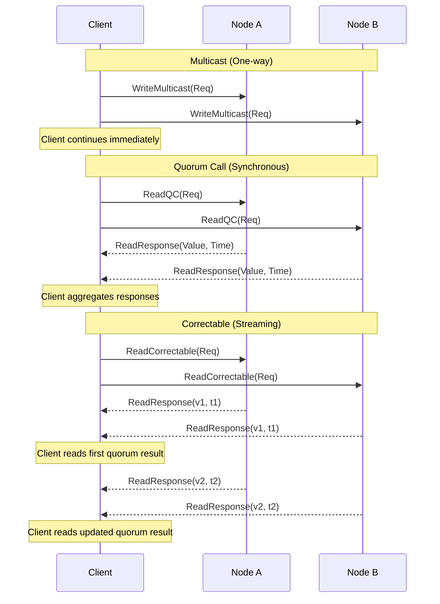
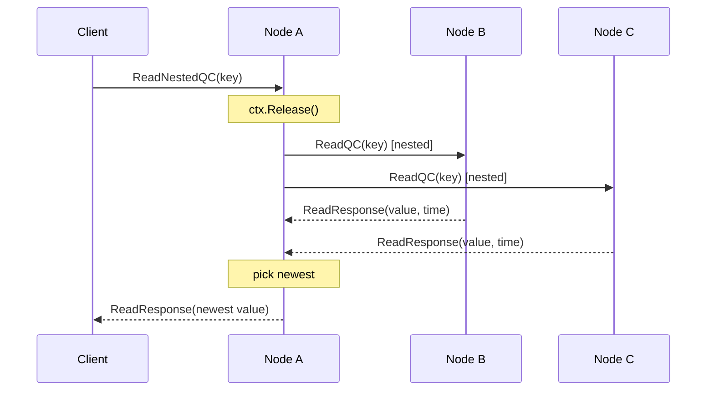
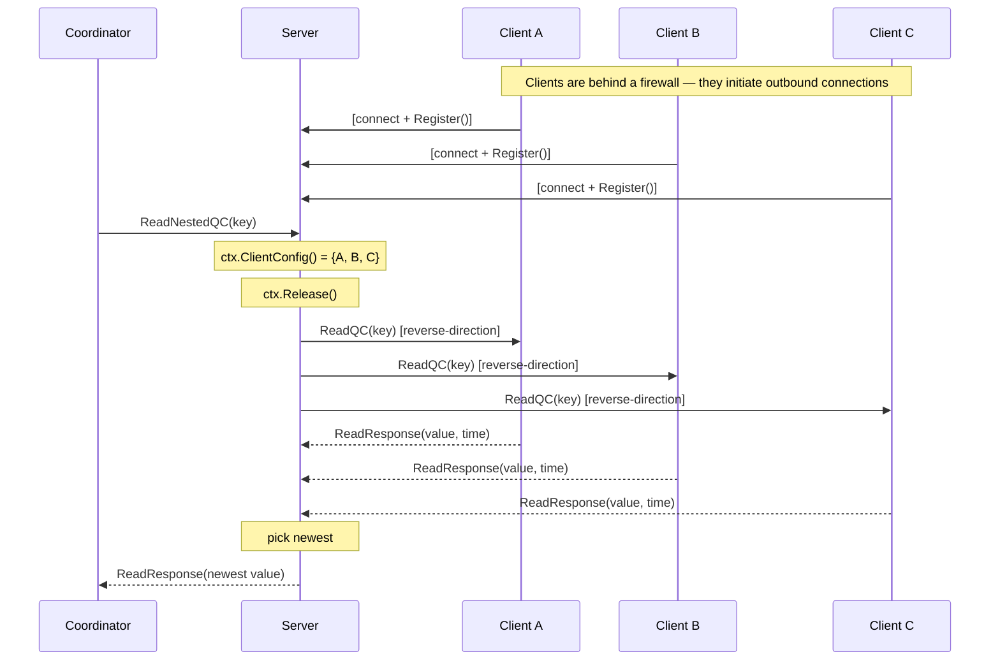

# User Guide

You may wish to read the gRPC [Getting Started documentation](http://www.grpc.io/docs/) before continuing.
Gorums uses gRPC under the hood, and exposes some of its configuration.
Gorums also uses [Protocol Buffers](https://developers.google.com/protocol-buffers) to specify messages and RPC methods.

## Prerequisites

This guide describes how to use Gorums as a user.
The guide requires a working Go installation.
At least Go version 1.26 is required.

There are a few tools that need to be installed first:

1. Install version 3 of `protoc`, the Protocol Buffers Compiler.
   Installation of this tool is OS/distribution specific.

   On Linux/macOS/WSL with Homebrew you can use:

   ```shell
   brew install protobuf
   ```

   See the [releases](https://github.com/google/protobuf/releases) page for details and other releases.

2. Install the [Go code generator](https://github.com/protocolbuffers/protobuf-go) for `protoc`.
   It can be installed with the following command:

   ```shell
   go install google.golang.org/protobuf/cmd/protoc-gen-go@latest
   ```

3. Install the Gorums plugin:

   ```shell
   go install github.com/relab/gorums/cmd/protoc-gen-gorums@latest
   ```

## Creating and Compiling a Protobuf Service Description into Gorums Code

In this example we will create a simple storage service.
The storage can store a single `{value, timestamp}` tuple with methods for reading and writing state.

First, we define our storage as a gRPC service by using the protocol buffers interface definition language (IDL).
Refer to the protocol buffers [language guide](https://developers.google.com/protocol-buffers/docs/proto3) to learn more about the Protobuf IDL.

The runnable version of this example lives in `examples/storage`.
The protobuf definition for that example lives in `examples/storage/proto/storage.proto`.
If you are starting from scratch, you can still create your own module and use the same proto structure.

```shell
mkdir $HOME/storageexample
cd $HOME/storageexample
go mod init storageexample
go get github.com/relab/gorums
```

### Call Types

Gorums offers several call types including quorum calls, and one-way unicast and multicast communication.
To select a call type for a Protobuf service method, specify one of the following options (they cannot be combined):

| Call type               | Gorums option                  | Description                                                                                                                                     |
| ----------------------- | ------------------------------ | ----------------------------------------------------------------------------------------------------------------------------------------------- |
| Ordered RPC             | no option                      | FIFO-ordered synchronous RPC to a single node.                                                                                                  |
| Unicast                 | `gorums.unicast`               | FIFO-ordered one-way asynchronous unicast.                                                                                                      |
| Multicast               | `gorums.multicast`             | FIFO-ordered one-way asynchronous multicast.                                                                                                    |
| Quorum Call             | `gorums.quorumcall`            | FIFO-ordered asynchronous quorum call on a configuration of nodes.                                                                              |
| Synchronous Quorum Call | `gorums.quorumcall`            | Synchronous variant; chain a terminal method (`.First()`, `.Majority()`, `.All()`, `.Threshold(n)`) to block until the quorum threshold is met. |
| Correctable             | `gorums.quorumcall` + `stream` | Streaming quorum call; use `.Correctable(n)` to observe progressive updates as nodes respond.                                                   |

The generated API is similar to unary gRPC, unless the `stream` keyword is used in the proto definition.
Server streaming is only supported for quorum calls.
Client streaming is not supported.



### Configuring Call Types in Protobuf

The following is a partial representation of `examples/storage/proto/storage.proto`, showing one RPC per call type.
The full service definition includes additional RPCs (e.g., `WriteRPC`, `WriteQC`) for completeness, but the examples here focus on one representative per call type.

```proto
edition = "2024";

package proto;
option go_package = "github.com/relab/gorums/examples/storage/proto";
option features.field_presence = IMPLICIT;
option features.enforce_naming_style = STYLE_LEGACY;

import "google/protobuf/empty.proto";
import "google/protobuf/timestamp.proto";
import "gorums.proto";

// Storage service defines the RPCs for a simple key-value storage system.
service Storage {
  // ReadRPC is a FIFO-ordered RPC to a single node.
  rpc ReadRPC(ReadRequest) returns (ReadResponse) {}

  // WriteUnicast is an asynchronous unicast to a single node.
  // No reply is collected.
  rpc WriteUnicast(WriteRequest) returns (google.protobuf.Empty) {
    option (gorums.unicast) = true;
  }

  // WriteMulticast is an asynchronous multicast to all nodes in a configuration.
  // No replies are collected.
  rpc WriteMulticast(WriteRequest) returns (google.protobuf.Empty) {
    option (gorums.multicast) = true;
  }

  // ReadQC is a FIFO-ordered synchronous quorum call.
  // Use terminal methods (.Majority(), .First(), etc.) to retrieve results.
  // Use .AsyncMajority() for async variant, .Correctable(n) for correctable variant.
  rpc ReadQC(ReadRequest) returns (ReadResponse) {
    option (gorums.quorumcall) = true;
  }

  // ReadCorrectable is a FIFO-ordered synchronous quorum call with server streaming.
  // The stream keyword enables correctable calls where nodes can send multiple
  // progressive updates. Use .Correctable(n) to watch for updates as they arrive.
  rpc ReadCorrectable(ReadRequest) returns (stream ReadResponse) {
    option (gorums.quorumcall) = true;
  }
}

// ReadRequest is the request message for Read RPCs and Read quorum calls.
message ReadRequest {
  string key = 1;
}

// ReadResponse is the response message for Read RPCs and Read quorum calls.
message ReadResponse {
  bool                      OK    = 1;
  string                    value = 2;
  google.protobuf.Timestamp time  = 3;
}

// WriteRequest is the request message for Write unicast and multicast calls.
message WriteRequest {
  string                    key   = 1;
  string                    value = 2;
  google.protobuf.Timestamp time  = 3;
}
```

For the `unicast` and `multicast` call types, the response message type will be unused by Gorums.

> **Reserved message names:** The following names are reserved by Gorums and cannot be used as proto message type names in your `.proto` files: `Configuration`, `Node`, `NodeContext`, `ConfigContext`.
> Using any of these names will cause a compile error in the generated code because Gorums injects type aliases with these names into every generated `_gorums.pb.go` file.

### Compiling the Service Definition

Next, we compile our service definition into Go code which includes:

1. Go code to access and manage the defined Protobuf messages.
2. A Gorums client API and server interface for the storage.

We simply invoke `protoc` to compile our Protobuf definition:

```shell
protoc -I="$(go list -m -f {{.Dir}} github.com/relab/gorums):." \
  --go_out=paths=source_relative:. \
  --gorums_out=paths=source_relative:. \
  storage.proto
```

The above step should produce two files named `storage.pb.go` and `storage_gorums.pb.go` in your package directory.
The former contains the Protobuf definitions of our messages.
The latter contains the Gorums generated client and server interfaces.

### Examining the Gorums Generated Code

Let us examine the `storage_gorums.pb.go` file to see the code generated from our Protobuf definitions.
The client functions below are generated by Gorums based on the call type specified in the Protobuf definition.
The first two functions are used to send requests to a single node determined by the `NodeContext`.

```go
func ReadRPC(ctx *gorums.NodeContext, in *ReadRequest) (resp *ReadResponse, err error)
func WriteUnicast(ctx *gorums.NodeContext, in *WriteRequest, opts ...gorums.CallOption) error
```

The three functions below are used to send requests to a configuration of nodes determined by the `ConfigContext`.
The last two functions return a `*gorums.Responses[*ReadResponse]` object, which is a collection of responses from the nodes in the configuration.

```go
func WriteMulticast(ctx *gorums.ConfigContext, in *WriteRequest, opts ...gorums.CallOption) error
func ReadQC(ctx *gorums.ConfigContext, in *ReadRequest, opts ...gorums.CallOption) *gorums.Responses[*ReadResponse]
func ReadCorrectable(ctx *gorums.ConfigContext, in *ReadRequest, opts ...gorums.CallOption) *gorums.Responses[*ReadResponse]
```

And this is our server interface:

```go
type StorageServer interface {
	ReadRPC(ctx gorums.ServerCtx, request *ReadRequest) (response *ReadResponse, err error)
	WriteUnicast(ctx gorums.ServerCtx, request *WriteRequest)
	WriteMulticast(ctx gorums.ServerCtx, request *WriteRequest)
	ReadQC(ctx gorums.ServerCtx, request *ReadRequest) (response *ReadResponse, err error)
	ReadCorrectable(ctx gorums.ServerCtx, request *ReadRequest, send func(response *ReadResponse) error) error
}
```

It is worth noting that unicast and multicast methods do not return a response or error, as they are one-way calls.
The client-side functions for these methods return an error if the request could not be sent, but do not return any information about the success or failure of the request at the server side.

**Note:**
You may decide to keep the `.proto` file and the generated `.pb.go` files in a separate directory/package and import that package (the generated Gorums API) into your application.
We skip that here for the sake of simplicity.

## Implementing the StorageServer

We now describe how to implement the `StorageServer` interface from above.

```go
type storageSrv struct {
  mut   sync.Mutex
  state *ReadResponse
}

func (srv *storageSrv) ReadRPC(_ gorums.ServerCtx, req *ReadRequest) (resp *ReadResponse, err error) {
  srv.mut.Lock()
  defer srv.mut.Unlock()
  return srv.state, nil
}

func (srv *storageSrv) WriteUnicast(_ gorums.ServerCtx, req *WriteRequest) {
  srv.mut.Lock()
  defer srv.mut.Unlock()
  if req.GetTime().AsTime().After(srv.state.GetTime().AsTime()) {
    srv.state = &ReadResponse{OK: true, Value: req.GetValue(), Time: req.GetTime()}
  }
}

func (srv *storageSrv) WriteMulticast(_ gorums.ServerCtx, req *WriteRequest) {
  srv.mut.Lock()
  defer srv.mut.Unlock()
  if req.GetTime().AsTime().After(srv.state.GetTime().AsTime()) {
    srv.state = &ReadResponse{OK: true, Value: req.GetValue(), Time: req.GetTime()}
  }
}

func (srv *storageSrv) ReadQC(_ gorums.ServerCtx, req *ReadRequest) (resp *ReadResponse, err error) {
  srv.mut.Lock()
  defer srv.mut.Unlock()
  return srv.state, nil
}

func (srv *storageSrv) ReadCorrectable(_ gorums.ServerCtx, req *ReadRequest, send func(response *ReadResponse) error) error {
  srv.mut.Lock()
  defer srv.mut.Unlock()
  return send(srv.state)
}
```

There are some important things to note about implementing the server interfaces:

* The handlers run in the order messages are received.
* Messages from the same sender are executed in FIFO order at all servers.
  See the auxiliary documentation for more information about [message ordering](./ordering.md) in Gorums.
* Messages from different senders may be received in a different order at the different servers.
  To guarantee messages from different senders are executed in-order at the different servers, you must use a total ordering protocol.
* Errors should be returned using the [`status` package](https://pkg.go.dev/google.golang.org/grpc/status?tab=doc).
* Handlers run synchronously, and hence a long-running handler will prevent other messages from being handled.
  To help solve this problem, our `ServerCtx` objects have a `Release()` function that releases the handler's lock on the server,
  which allows the next request to be processed. After `ctx.Release()` has been called, the handler may run concurrently
  with the handlers for the next requests. The handler automatically calls `ctx.Release()` after returning.

  ```go
  func (srv *storageSrv) ReadRPC(ctx gorums.ServerCtx, req *ReadRequest) (resp *ReadResponse, err error) {
    // any code running before this will be executed in-order
    ctx.Release()
    // after Release() has been called, a new request handler may be started,
    // and thus it is not guaranteed that the replies will be sent back the same order.
    srv.mut.Lock()
    defer srv.mut.Unlock()
    return srv.state, nil
  }
  ```

* The context passed to the handlers is derived from the gRPC stream context, extended with any per-request metadata carried in the incoming message.
  This context can be used to retrieve [metadata](https://github.com/grpc/grpc-go/blob/master/Documentation/grpc-metadata.md)
  and [peer](https://godoc.org/google.golang.org/grpc/peer) information from the client.

To start the server, we need to create a *listener* and a *GorumsServer*, and then register our server implementation:

```go
func ExampleStorageServer(port int) {
  lis, err := net.Listen("tcp", fmt.Sprintf(":%d", port))
  if err != nil {
    log.Fatal(err)
  }
  gorumsSrv := gorums.NewServer()
  srv := storageSrv{state: &ReadResponse{}}
  RegisterStorageServer(gorumsSrv, &srv)
  gorumsSrv.Serve(lis)
}
```

## Implementing the StorageClient

Next, we write client code to call RPCs on our servers.
The first thing we need to do is to create a `Configuration` using `gorums.NewConfig`.
`NewConfig` establishes connections to the given nodes and returns a configuration
ready for making RPC calls.

We can forward gRPC dial options to `NewConfig` if needed.
Below we use only a simple insecure connection option.

```go
package proto

import (
  "log"

  "github.com/relab/gorums"
  "google.golang.org/grpc"
  "google.golang.org/grpc/credentials/insecure"
)

func ExampleStorageClient() {
  addrs := []string{
    "127.0.0.1:8080",
    "127.0.0.1:8081",
    "127.0.0.1:8082",
  }
  // Create a configuration including all nodes
  allNodesConfig, err := gorums.NewConfig(
    gorums.WithNodeList(addrs),
    gorums.WithDialOptions(
      grpc.WithTransportCredentials(insecure.NewCredentials()),
    ),
  )
  if err != nil {
    log.Fatalln("error creating read config:", err)
  }
  defer allNodesConfig.Close()
```

A configuration is a set of nodes on which RPC calls can be invoked.
`WithNodeList` assigns a unique identifier to each node by address.

The `Configuration` type has several useful methods for combining and filtering configurations.
Inspect the package documentation or source code for details.

We can now invoke the WriteUnicast RPC on each `node` in the configuration:

```go
  req := &WriteRequest{
    Key:   "mykey",
    Value: "42",
    Time:  timestamppb.Now(),
  }

  // Invoke WriteUnicast RPC on all nodes in config
  ctx := context.Background()
  for _, node := range allNodesConfig.Nodes() {
    nodeCtx := node.Context(ctx)
    err := WriteUnicast(nodeCtx, req)
    if err != nil {
      log.Fatalln("write rpc returned error:", err)
    }
  }
```

While Gorums allows us to call RPCs on individual nodes as we did above, Gorums also provides call types *multicast* and *quorum call* that allow us to invoke an RPC on all nodes in a configuration with a single invocation, as we show in the next section.

## Quorum Calls

Instead of invoking an RPC explicitly on all nodes in a configuration, Gorums allows users to invoke a *quorum call* that sends RPCs to all nodes in parallel and collects responses.

Specifying the `quorumcall` option for RPC methods:

```protobuf
rpc ReadQC(ReadRequest) returns (ReadResponse) {
  option (gorums.quorumcall) = true;
}
```

The generated code provides a function for each quorum call method:

```go
func ReadQC(ctx *gorums.ConfigContext, in *ReadRequest, opts ...gorums.CallOption) *gorums.Responses[*ReadResponse]
```

This function returns a `*gorums.Responses[*ReadResponse]` object that provides several ways to aggregate and process responses.

### Terminal Methods for Response Aggregation

The `*gorums.Responses[T]` type provides built-in *terminal methods* for common aggregation patterns:

| Method          | Description               | Returns When                         |
| --------------- | ------------------------- | ------------------------------------ |
| `.First()`      | First successful response | Any node responds successfully       |
| `.Majority()`   | Majority of responses     | ⌈(n+1)/2⌉ nodes respond successfully |
| `.All()`        | All responses             | All n nodes respond                  |
| `.Threshold(n)` | At least n responses      | n nodes respond successfully         |

Each terminal method blocks until the threshold is met or the context is canceled, then returns a single aggregated response and an error.

### Using Terminal Methods

```go
func ExampleTerminalMethods(config *Configuration) {
  ctx := context.Background()
  cfgCtx := config.Context(ctx)

  // Fast reads: return first successful response
  reply, err := ReadQC(cfgCtx, &ReadRequest{Key: "x"}).First()

  // Crash fault tolerance: require simple majority
  reply, err = ReadQC(cfgCtx, &ReadRequest{Key: "x"}).Majority()

  // Wait for all nodes (useful for debugging)
  reply, err = ReadQC(cfgCtx, &ReadRequest{Key: "x"}).All()

  // Custom threshold (e.g., f+1 for crash tolerance)
  f := 1
  reply, err = ReadQC(cfgCtx, &ReadRequest{Key: "x"}).Threshold(f + 1)
}
```

Terminal methods return `gorums.ErrIncomplete` when:

* The context is canceled before the threshold is met
* Not enough successful responses are received
* All nodes return errors

### Async and Correctable Variants

Quorum calls support asynchronous and correctable variants through additional *terminal methods*.

**Async variants** return a future (`*Async[T]`) that can be awaited later:

| Method               | Description          | Returns     |
| -------------------- | -------------------- | ----------- |
| `.AsyncFirst()`      | First response async | `*Async[T]` |
| `.AsyncMajority()`   | Majority async       | `*Async[T]` |
| `.AsyncAll()`        | All responses async  | `*Async[T]` |
| `.AsyncThreshold(n)` | Threshold async      | `*Async[T]` |

```go
future := ReadQC(cfgCtx, &ReadRequest{Key: "x"}).AsyncMajority()
// Do other work...
reply, err := future.Get()
```

**Correctable variant** provides progressive updates as more responses arrive:

| Method            | Description                | Returns           |
| ----------------- | -------------------------- | ----------------- |
| `.Correctable(n)` | Progressive updates from n | `*Correctable[T]` |

```go
corr := ReadCorrectable(cfgCtx, &ReadRequest{Key: "x"}).Correctable(2)  // Initial threshold
reply, level, err := corr.Get()
<-corr.Watch(3)  // Wait for higher level
reply, level, err = corr.Get()
```

### Send-Timing Model

Understanding when messages are actually sent matters for ordering and for reasoning about concurrent calls.

**Quorum calls are lazy.** Messages are not sent to nodes until the caller consumes the `*Responses[T]` object by calling a terminal method (`First`, `Majority`, `All`, `Threshold`) or by calling `.Results()` to begin iterating.
This gives interceptors a chance to register per-node request transformations before any bytes go on the wire.

**Async variants send immediately.** `AsyncFirst`, `AsyncMajority`, `AsyncAll`, and `AsyncThreshold` call `sendNow` synchronously before spawning the goroutine that awaits the threshold.
This preserves message ordering when multiple async calls are issued in sequence:

```go
// Messages for both calls are enqueued in order before either goroutine runs.
futA := WriteQC(cfgCtx, reqA).AsyncMajority()
futB := WriteQC(cfgCtx, reqB).AsyncMajority()
_, _ = futA.Get()
_, _ = futB.Get()
```

**Multicast and unicast send immediately.** One-way calls do not return a `*Responses[T]` object, so there is no deferred consumption step; messages are enqueued as soon as the call is made.

Summary:

| Call type           | When messages are sent        |
| ------------------- | ----------------------------- |
| Quorum call (sync)  | On first consumption (lazy)   |
| Quorum call (async) | Immediately, before goroutine |
| Multicast / unicast | Immediately                   |

## Iterator-Based Custom Aggregation

For complex aggregation logic beyond the built-in terminal methods, use the iterator API provided by `responses.Results()`.
The iterator yields responses progressively as they arrive, allowing custom decision-making logic.

### Basic Iterator Pattern

```go
func newestValue(responses *gorums.Responses[*ReadResponse]) (*ReadResponse, error) {
  var newest *ReadResponse
  for resp := range responses.Results() {
    // resp.Value contains the response message (may be nil if resp.Err is set)
    // resp.Err contains any error from that node (nil if successful)
    // resp.NodeID contains the node identifier

    if resp.Err != nil {
      continue  // Skip failed responses
    }

    if newest == nil || resp.Value.GetTime().AsTime().After(newest.GetTime().AsTime()) {
      newest = resp.Value
    }
  }

  if newest == nil {
    return nil, gorums.ErrIncomplete
  }
  return newest, nil
}

// Usage
cfgCtx := config.Context(ctx)
reply, err := newestValue(ReadQC(cfgCtx, &ReadRequest{}))
```

### Iterator Helper Methods

The iterator returned by `.Results()` provides helper methods that can be chained before consuming the sequence:

#### `IgnoreErrors()` - Skip Failed Responses

```go
func countSuccessful(responses *gorums.Responses[*Response]) int {
  count := 0
  for resp := range responses.Results().IgnoreErrors() {
    count++
    // resp.Value is guaranteed to be non-nil
    // resp.Err is guaranteed to be nil
  }
  return count
}
```

#### `Filter()` - Custom Filtering

```go
func validResponses(responses *gorums.Responses[*Response]) []*Response {
  var valid []*Response

  // Only include responses that pass validation
  filtered := responses.Results().Filter(func(nr gorums.NodeResponse[*Response]) bool {
    return nr.Err == nil && isValid(nr.Value)
  })

  for resp := range filtered {
    valid = append(valid, resp.Value)
  }
  return valid
}
```

#### `CollectN()` and `CollectAll()` - Collect Multiple Responses

```go
func majorityWrite(responses *gorums.Responses[*WriteResponse]) (*WriteResponse, error) {
  majority := (responses.Size() + 1) / 2

  // Collect first 'majority' successful responses
  replies := responses.Results().IgnoreErrors().CollectN(majority)

  if len(replies) < majority {
    return nil, gorums.ErrIncomplete
  }

  // Process the map[uint32]*WriteResponse
  return aggregateWrites(replies), nil
}

// allSuccessful collects all successful responses; errored nodes are skipped.
func allSuccessful(responses *gorums.Responses[*Response]) map[uint32]*Response {
  return responses.Results().IgnoreErrors().CollectAll()
}

// allResponses collects all responses; errored nodes are included with a zero value.
// Only use this when you know all nodes will succeed or you handle zero values.
func allResponses(responses *gorums.Responses[*Response]) map[uint32]*Response {
  return responses.Results().CollectAll()
}
```

#### Per-Node Error Inspection

`CollectN` and `CollectAll` return `map[uint32]Resp` and do not preserve errors.
When you need the actual error from a specific node, range over the results sequence directly:

```go
func inspectPerNodeErrors(responses *gorums.Responses[*Response]) {
  var errs []error
  replies := make(map[uint32]*Response)

  for result := range responses.Results() {
    if result.Err != nil {
      // result.NodeID identifies which node failed
      errs = append(errs, fmt.Errorf("node %d: %w", result.NodeID, result.Err))
      continue
    }
    replies[result.NodeID] = result.Value
  }

  // errs holds per-node failures; replies holds successful values
}
```

Use `Results().IgnoreErrors()` or `Results().CollectAll()` when you do not need per-node error details.

### Complete Example: Storage Client with Custom Aggregation

```go
func ExampleStorageClient() {
  addrs := []string{
    "127.0.0.1:8080",
    "127.0.0.1:8081",
    "127.0.0.1:8082",
  }

  // Create a configuration with all nodes
  config, err := gorums.NewConfig(
    gorums.WithNodeList(addrs),
    gorums.WithDialOptions(
      grpc.WithTransportCredentials(insecure.NewCredentials()),
    ),
  )
  if err != nil {
    log.Fatalln("error creating configuration:", err)
  }
  defer config.Close()

  ctx := context.Background()
  cfgCtx := config.Context(ctx)

  // Option 1: Use custom aggregation function
  reply, err := newestValue(ReadQC(cfgCtx, &ReadRequest{Key: "x"}))
  if err != nil {
    log.Fatalln("read quorum call returned error:", err)
  }
  fmt.Printf("Read value: %v\n", reply.GetValue())

  // Option 2: Use built-in terminal method
  reply, err = ReadQC(cfgCtx, &ReadRequest{Key: "x"}).Majority()
  if err != nil {
    log.Fatalln("read quorum call returned error:", err)
  }
  fmt.Printf("Read value: %v\n", reply.GetValue())
}

// newestValue returns the response with the most recent timestamp
func newestValue(responses *gorums.Responses[*ReadResponse]) (*ReadResponse, error) {
  var newest *ReadResponse
  for resp := range responses.Results() {
    if resp.Err != nil {
      continue
    }
    if newest == nil || resp.Value.GetTime().AsTime().After(newest.GetTime().AsTime()) {
      newest = resp.Value
    }
  }
  if newest == nil {
    return nil, gorums.ErrIncomplete
  }
  return newest, nil
}
```

### Early Termination with Iterators

Iterators allow early termination once a condition is met:

```go
func fastQuorum(responses *gorums.Responses[*Response]) (*Response, error) {
  const threshold = 2
  count := 0

  for resp := range responses.Results().IgnoreErrors() {
    count++
    if count >= threshold {
      return resp.Value, nil  // Return immediately after threshold
    }
  }

  return nil, gorums.ErrIncomplete
}
```

## Custom Return Types

Gorums supports custom aggregation functions that return types different from the proto response type.
This is useful when you need to aggregate multiple responses into a summary, statistics object, or any other custom type.

### Recommended Pattern: Functions Taking `*Responses[Resp]`

The recommended approach is to define functions that accept `*Responses[Resp]` directly.
This gives you full access to all iterator methods (`IgnoreErrors()`, `Filter()`, `CollectN()`, `CollectAll()`) and the ability to return any type.

```go
// Custom aggregation function that returns a different type
// Input: *Responses[*MemoryStat], Output: *MemoryStatList
func CollectStats(resp *gorums.Responses[*MemoryStat]) (*MemoryStatList, error) {
  replies := resp.IgnoreErrors().CollectAll()
  if len(replies) == 0 {
    return nil, gorums.ErrIncomplete
  }
  return &MemoryStatList{
    MemoryStats: slices.Collect(maps.Values(replies)),
  }, nil
}

// Usage: Call the function directly, passing the Responses object
cfgCtx := config.Context(ctx)
memStats, err := CollectStats(StopBenchmark(cfgCtx, &StopRequest{}))
```

### Example: Same Type Aggregation

When the return type matches the response type, you can still use this pattern for custom quorum logic:

```go
// Custom majority quorum with validation
func ValidatedMajority(resp *gorums.Responses[*ReadResponse]) (*ReadResponse, error) {
  replies := resp.IgnoreErrors().CollectN(resp.Size()/2 + 1)
  if len(replies) < resp.Size()/2+1 {
    return nil, gorums.ErrIncomplete
  }
  // Return the first valid reply
  for _, r := range replies {
    if isValid(r) {
      return r, nil
    }
  }
  return nil, gorums.ErrIncomplete
}

// Usage
cfgCtx := config.Context(ctx)
state, err := ValidatedMajority(ReadQC(cfgCtx, &ReadRequest{}))
```

### Example: Custom Return Type (Slice)

```go
// Collect all string values from responses
func CollectAllValues(resp *gorums.Responses[*StringValue]) ([]string, error) {
  replies := resp.IgnoreErrors().CollectAll()
  if len(replies) == 0 {
    return nil, gorums.ErrIncomplete
  }
  result := make([]string, 0, len(replies))
  for _, v := range replies {
    result = append(result, v.GetValue())
  }
  return result, nil
}

// Usage: Returns []string instead of *StringValue
values, err := CollectAllValues(GetValues(cfgCtx, &Request{}))
```

### Example: Computing Aggregate Statistics

```go
// Aggregate results from multiple nodes into a summary
func AggregateResults(resp *gorums.Responses[*Result]) (*Result, error) {
  replies := resp.IgnoreErrors().CollectAll()
  if len(replies) == 0 {
    return nil, gorums.ErrIncomplete
  }

  summary := &Result{}
  for _, reply := range replies {
    summary.TotalOps += reply.TotalOps
    summary.TotalTime += reply.TotalTime
    summary.Throughput += reply.Throughput
  }

  // Calculate averages
  n := uint64(len(replies))
  summary.TotalOps /= n
  summary.TotalTime /= int64(n)
  summary.Throughput /= float64(n)

  return summary, nil
}
```

### Example: Returning a Primitive Type

```go
// Count responses from specific nodes
func CountFromPrimaryNodes(resp *gorums.Responses[*Response]) (int, error) {
  count := 0
  for r := range resp.IgnoreErrors().Filter(func(nr gorums.NodeResponse[*Response]) bool {
    return isPrimaryNode(nr.NodeID)
  }) {
    count++
  }
  if count == 0 {
    return 0, gorums.ErrIncomplete
  }
  return count, nil
}
```

### Example: Explicit Error Handling

When you need to handle errors from individual nodes explicitly:

```go
// Require all nodes to succeed
func RequireAllSuccess(resp *gorums.Responses[*Response]) (*Response, error) {
  var first *Response
  for r := range resp.Results() {
    if r.Err != nil {
      return nil, r.Err  // Fail fast on any error
    }
    if first == nil {
      first = r.Value
    }
  }
  if first == nil {
    return nil, gorums.ErrIncomplete
  }
  return first, nil
}
```

## Interceptors for Request/Response Transformation

Gorums provides interceptors to transform requests and responses on a per-node basis.
Interceptors are passed as call options and can be chained together.

### MapRequest Interceptor

Transform requests before sending to each node:

```go
cfgCtx := config.Context(ctx)
resp, err := WriteQC(cfgCtx, req,
    gorums.Interceptors(
        gorums.MapRequest(func(req *WriteRequest, node *gorums.Node) *WriteRequest {
            // Customize request for each node
            return &WriteRequest{Value: fmt.Sprintf("%s-node-%d", req.Value, node.ID())}
        }),
    ),
).Majority()
```

### MapResponse Interceptor

Transform responses received from each node:

```go
resp, err := ReadQC(cfgCtx, req,
    gorums.Interceptors(
        gorums.MapResponse(func(resp *ReadResponse, node *gorums.Node) *ReadResponse {
            // Transform response, e.g., add node ID
            resp.NodeID = node.ID()
            return resp
        }),
    ),
).Majority()
```

### Multicast/Unicast with MapRequest

```go
// Send different messages to each node in a multicast
cfgCtx := config.Context(ctx)
WriteMulticast(cfgCtx, &WriteRequest{},
    gorums.Interceptors(
        gorums.MapRequest(func(msg *WriteRequest, node *gorums.Node) *WriteRequest {
            return &WriteRequest{Value: fmt.Sprintf("node-%d", node.ID())}
        }),
    ),
)
```

**Note:** If `MapRequest` returns `nil` for a node, the message will not be sent to that node.

### Custom Interceptors

Beyond the built-in `MapRequest` and `MapResponse` interceptors, you can create custom interceptors for logging, filtering, or other cross-cutting concerns.

A custom interceptor has the signature:

```go
func(ctx *gorums.ClientCtx[Req, Resp], next gorums.ResponseSeq[Resp]) gorums.ResponseSeq[Resp]
```

The interceptor receives:

* `ctx` - the `ClientCtx` providing access to:
  * `.Request()` - the original request
  * `.Config()` - the configuration being used
  * `.Method()` - the RPC method name
  * `.Nodes()` - all nodes in the configuration
  * `.Node(id)` - get a specific node by ID
  * `.Size()` - number of nodes in the configuration
* `next` - the response iterator from the previous interceptor (or the default iterator)

The interceptor returns a new `ResponseSeq` that wraps `next` with custom logic.

#### Chaining Interceptors

Multiple interceptors can be passed to `gorums.Interceptors()` and are executed in order:

```go
cfgCtx := config.Context(ctx)
resp, err := ReadQC(cfgCtx, req,
    gorums.Interceptors(
        loggingInterceptor,
        gorums.MapRequest(transformFunc),
        filterInterceptor,
    ),
).Majority()
```

#### Example: Logging Interceptor

Create a logging interceptor that wraps the response iterator:

```go
func LoggingInterceptor[Req, Resp proto.Message](
    ctx *gorums.ClientCtx[Req, Resp],
    next gorums.ResponseSeq[Resp],
) gorums.ResponseSeq[Resp] {
    startTime := time.Now()
    log.Printf("[%s] Starting quorum call with request: %v", ctx.Method(), ctx.Request())

    // Wrap the response iterator to log each response
    return func(yield func(gorums.NodeResponse[Resp]) bool) {
        count := 0
        for resp := range next {
            count++
            if resp.Err != nil {
                log.Printf("[%s] Node %d error: %v", ctx.Method(), resp.NodeID, resp.Err)
            } else {
                log.Printf("[%s] Node %d response received", ctx.Method(), resp.NodeID)
            }
            if !yield(resp) {
                log.Printf("[%s] Iteration stopped after %d responses", ctx.Method(), count)
                return
            }
        }
        log.Printf("[%s] Completed: %d responses in %v", ctx.Method(), count, time.Since(startTime))
    }
}

// Usage
resp, err := ReadQC(cfgCtx, req,
    gorums.Interceptors(LoggingInterceptor[*ReadRequest, *ReadResponse]),
).Majority()
```

#### Example: Response Filtering Interceptor

Filter out responses that don't meet certain criteria:

```go
func FilterInterceptor[Req, Resp proto.Message](
    shouldInclude func(Resp) bool,
) gorums.QuorumInterceptor[Req, Resp] {
    return func(ctx *gorums.ClientCtx[Req, Resp], next gorums.ResponseSeq[Resp]) gorums.ResponseSeq[Resp] {
        return func(yield func(gorums.NodeResponse[Resp]) bool) {
            for resp := range next {
                // Skip responses that don't pass the filter
                if resp.Err == nil && !shouldInclude(resp.Value) {
                    continue
                }
                if !yield(resp) {
                    return
                }
            }
        }
    }
}

// Usage: only include responses with timestamp > threshold
threshold := time.Now().Add(-1 * time.Hour)
resp, err := ReadQC(cfgCtx, req,
    gorums.Interceptors(
        FilterInterceptor[*ReadRequest, *ReadResponse](func(r *ReadResponse) bool {
            return r.GetTime().AsTime().After(threshold)
        }),
    ),
).Majority()
```

#### Example: Counting Interceptor

Count responses passing through the interceptor:

```go
func CountingInterceptor[Req, Resp proto.Message](
    counter *int,
) gorums.QuorumInterceptor[Req, Resp] {
    return func(_ *gorums.ClientCtx[Req, Resp], next gorums.ResponseSeq[Resp]) gorums.ResponseSeq[Resp] {
        return func(yield func(gorums.NodeResponse[Resp]) bool) {
            for resp := range next {
                *counter++
                if !yield(resp) {
                    return
                }
            }
        }
    }
}
```

**Note:** Custom interceptors can be defined in any package. The `ClientCtx` type and `QuorumInterceptor` signature are exported from the gorums package.

### Server-Side Interceptors

Gorums also supports server-side interceptors that wrap inbound RPC handlers, similar to gRPC server interceptors.
A server-side interceptor implements the `gorums.Interceptor` signature:

```go
type Interceptor func(ctx gorums.ServerCtx, in *gorums.Message, next gorums.Handler) (*gorums.Message, error)
```

You can pass multiple interceptors when starting a Gorums server. They can perform logging, latency injection, metadata insertion, and request validation before sending the request to the handler.

Below are several examples based on the `examples/interceptors` package.

#### Server-Side Logging Interceptor

```go
func LoggingInterceptor(addr string) gorums.Interceptor {
    return func(ctx gorums.ServerCtx, in *gorums.Message, next gorums.Handler) (*gorums.Message, error) {
        req := gorums.AsProto[proto.Message](in)
        log.Printf("[%s]: LoggingInterceptor(incoming): Method=%s, Message=%s", addr, in.GetMethod(), req)

        start := time.Now()
        out, err := next(ctx, in)

        duration := time.Since(start)
        resp := gorums.AsProto[proto.Message](out)
        log.Printf("[%s]: LoggingInterceptor(outgoing): Method=%s, Duration=%s, Err=%v, Message=%v", addr, in.GetMethod(), duration, err, resp)
        return out, err
    }
}
```

#### Delay and Metadata Interceptors

Interceptors can inject arbitrary delays based on client properties or attach metadata to the incoming requests:

```go
func DelayedInterceptor(ctx gorums.ServerCtx, in *gorums.Message, next gorums.Handler) (*gorums.Message, error) {
    delay := 50 * time.Millisecond
    time.Sleep(delay)
    return next(ctx, in)
}

func MetadataInterceptor(ctx gorums.ServerCtx, in *gorums.Message, next gorums.Handler) (*gorums.Message, error) {
    // Inject a custom metadata field for the handler
    entry := gorums.MetadataEntry_builder{
        Key:   "customKey",
        Value: "customValue",
    }.Build()
    in.SetEntry([]*gorums.MetadataEntry{entry})

    return next(ctx, in)
}
```

#### Rejecting Requests (Filtering)

A server interceptor can also stop a request from reaching the handler entirely.

```go
// NoFooAllowedInterceptor rejects requests for messages with key "foo".
func NoFooAllowedInterceptor[T interface{ GetKey() string }](ctx gorums.ServerCtx, in *gorums.Message, next gorums.Handler) (*gorums.Message, error) {
    if req, ok := gorums.AsProto[proto.Message](in).(T); ok {
        if req.GetKey() == "foo" {
            return nil, fmt.Errorf("requests for key 'foo' are not allowed")
        }
    }
    return next(ctx, in)
}
```

## Server Configuration Callbacks

Two server options expose hooks that fire at connection or configuration change time.
Both are passed to `gorums.NewServer` as `ServerOption` values.

### WithConnectCallback

`WithConnectCallback` registers a function called each time a node opens or reopens a stream to this server.

**Signature:**

```go
gorums.WithConnectCallback(func(ctx context.Context) {})
```

**When it runs:** immediately after a new stream is accepted by the server, before any messages are processed on that stream.

**What is available:** the `context.Context` is the gRPC stream context.
`metadata.FromIncomingContext(ctx)` returns all key/value metadata pairs sent by the connecting client.
`peer.FromContext(ctx)` (from `google.golang.org/grpc/peer`) returns the remote network address.

**Safe side effects:** reading metadata, logging, writing to atomics, or signaling a channel.
The callback runs synchronously during stream setup — keep it fast and do not call back into the `*gorums.Server`.

#### Example: Logging Incoming Metadata

The following example shows how a server can extract a custom `client-id` metadata value sent by each connecting node.
This pattern is exercised in `server_test.go`.

```go
gorumsSrv := gorums.NewServer(
    gorums.WithConnectCallback(func(ctx context.Context) {
        md, ok := metadata.FromIncomingContext(ctx)
        if !ok {
            return
        }
        if vals := md.Get("client-id"); len(vals) > 0 {
            log.Printf("peer connected, client-id=%s", vals[0])
        }
    }),
)
```

The connecting client attaches the metadata with `WithMetadata`:

```go
config, err := gorums.NewConfig(
    gorums.WithNodeList(addrs),
    gorums.WithMetadata(metadata.New(map[string]string{"client-id": "replica-3"})),
    gorums.WithDialOptions(grpc.WithTransportCredentials(insecure.NewCredentials())),
)
```

### WithConfig onChange Callback

`WithConfig` accepts an optional `onChange func(gorums.Configuration)` variadic argument.
The callback is called after every change to the known-peer configuration — that is, each time a pre-configured peer connects or disconnects.

**Signature:**

```go
gorums.WithConfig(myNodeID, nodeListOption, func(cfg gorums.Configuration) { ... })
```

**When it runs:** after every change to the known-peer configuration.
For peer connect/disconnect events, the callback runs inside the server's internal configuration lock, immediately after the configuration slice has been replaced.
The callback also fires once during `NewServer` construction (with the initial configuration, which contains only the self-node when no peers have connected yet)); that initial construction-time call does **not** run under the internal configuration lock.

**What is available:** a configuration of connected known peers, sorted by node ID.
The self-node (this server's own ID) is always included regardless of connectivity.

**Safe side effects:** signaling a channel, writing to an atomic, or copying the slice.
For connect/disconnect-triggered callbacks, the callback is invoked while holding the internal lock, so it must **not** call `srv.Config()`, `ctx.Config()`, or any other method that acquires the same lock.
Do not perform blocking or long-running work inside the callback, including during the initial construction-time call.

#### Example: Reacting to Peer Membership Changes

The following example shows how a server can wait until a quorum of peers is connected before beginning to serve requests.

```go
const quorumSize = 2 // majority for a three-node cluster, including self

ready := make(chan struct{}, 1)

gorumsSrv := gorums.NewServer(
    gorums.WithConfig(myNodeID, gorums.WithNodeList(peerAddrs),
        func(cfg gorums.Configuration) {
            if len(cfg) >= quorumSize {
                select {
                case ready <- struct{}{}:
                default:
                }
            }
        },
    ),
)

// Block until a quorum connects before accepting client requests.
<-ready
log.Println("quorum ready, starting to serve")
```

The self-node is always present in `cfg`, so a three-node cluster (`quorumSize = 2`) will fire the signal as soon as a single remote peer connects.

## Error Handling

Gorums provides structured error types to help you understand and handle failures in quorum calls.
The primary error type is `QuorumCallError`, which contains detailed information about which nodes failed and why.

### QuorumCallError

A `QuorumCallError` is returned when a quorum call fails.
It provides the following methods:

* **`Cause() error`** - Returns the underlying cause of the failure (e.g., `ErrIncomplete`, `ErrSendFailure`)
* **`NodeErrors() int`** - Returns the number of nodes that failed
* **`Unwrap() []error`** - Supports error unwrapping for use with `errors.Is` and `errors.As`

The error implements Go's standard error unwrapping interface, allowing `errors.Is()` and `errors.As()` to check both the direct cause and any wrapped node-specific errors.

#### Common Error Causes

Gorums defines several sentinel errors that commonly appear as the cause of a `QuorumCallError`:

* **`ErrIncomplete`** - The call could not be completed due to insufficient non-error replies to form a quorum
* **`ErrSendFailure`** - Message sending failed for one or more nodes

### Error Handling Example

Here's how to properly handle errors from a quorum call:

```go
func handleQuorumCall(config *gorums.Configuration, req *ReadRequest) {
  ctx, cancel := context.WithTimeout(context.Background(), 5*time.Second)
  defer cancel()

  cfgCtx := config.Context(ctx)
  reply, err := ReadQC(cfgCtx, req).Majority()

  if err != nil {
    // Check if it's a QuorumCallError
    var qcErr gorums.QuorumCallError
    if errors.As(err, &qcErr) {
      log.Printf("Quorum call failed: %v", qcErr.Cause())
      log.Printf("Failed nodes: %d", qcErr.NodeErrors())

      // Handle specific cause types
      if errors.Is(err, gorums.ErrIncomplete) {
        // Not enough replies to form a quorum
        log.Println("Insufficient responses to reach quorum")
      }
    }

    // Check for context errors
    if errors.Is(err, context.DeadlineExceeded) {
      log.Println("Quorum call timed out")
    } else if errors.Is(err, context.Canceled) {
      log.Println("Quorum call was canceled")
    }
    return
  }

  // Process successful reply
  log.Printf("Read successful: %v", reply)
}
```

### Checking for Specific Error Types

Use `errors.Is()` and `errors.As()` to check for specific error types, including both the direct cause and any node-specific errors:

```go
// Check if the error is caused by insufficient responses
if errors.Is(err, gorums.ErrIncomplete) {
  // Handle incomplete quorum
}

// Check if any node returned a specific gRPC error
if errors.Is(err, status.Error(codes.Unavailable, "")) {
  // Handle unavailable nodes
}

// Extract custom error types from node failures
var customErr MyCustomError
if errors.As(err, &customErr) {
  // Handle custom error from a node
}
```

## Handling Failed Nodes in Configurations

When a quorum call fails, you can create a new configuration that excludes the failed nodes.
The `WithoutErrors` method allows you to filter nodes based on the errors they returned:

```go
import (
  "context"
  "errors"
  "io"

  "github.com/relab/gorums"
)

// Invoke a quorum call
cfgCtx := config.Context(ctx)
state, err := ReadQC(cfgCtx, &ReadRequest{}).Majority()
if err != nil {
  var qcErr gorums.QuorumCallError
  if errors.As(err, &qcErr) {
    // Option 1: Exclude all failed nodes
    newConfig := config.WithoutErrors(qcErr)

    // Option 2: Exclude only nodes with specific error types
    // For example, exclude only nodes that timed out
    newConfig = config.WithoutErrors(qcErr, context.DeadlineExceeded)

    // Option 3: Exclude nodes with multiple specific error types
    newConfig = config.WithoutErrors(qcErr,
      context.DeadlineExceeded,
      context.Canceled,
      io.EOF,
    )

    // Retry the operation with the new configuration
    newCfgCtx := newConfig.Context(ctx)
    state, err = ReadQC(newCfgCtx, &ReadRequest{}).Majority()
  }
}
```

The error type matching uses `errors.Is`, which properly handles wrapped errors.
This allows you to filter nodes based on the underlying cause of their failures, enabling fine-grained control over which nodes to exclude when creating new configurations.

## Working with Configurations

Below is an example demonstrating how to work with configurations.
These configurations are viewed from the client's perspective, and to actually make quorum calls on these configurations, there must be server endpoints to connect to.
Error handling is omitted for brevity except where the result is used.

In the example below, we simply use fixed quorum sizes.

```go
func ExampleConfigClient() {
  addrs := []string{
    "127.0.0.1:8080",
    "127.0.0.1:8081",
    "127.0.0.1:8082",
  }
  // Create base configuration c1 from addrs, giving |c1| = 3.
  c1, err := gorums.NewConfig(
    gorums.WithNodeList(addrs),
    gorums.WithDialOptions(
      grpc.WithTransportCredentials(insecure.NewCredentials()),
    ),
  )
  if err != nil {
    log.Fatalln("error creating configuration:", err)
  }
  defer c1.Close()

  newAddrs := []string{
    "127.0.0.1:9080",
    "127.0.0.1:9081",
  }
  // Extend c1 with newAddrs; c2 shares c1's connection pool, |c2| = |c1| + |newAddrs| = 5.
  c2, _ := c1.Extend(gorums.WithNodeList(newAddrs))

  // c3 = nodes in c2 not in c1, giving |c3| = |newAddrs| = 2.
  c3 := c2.Difference(c1)

  // c4 = union of c1 and c3, giving |c4| = |c1| + |c3| = 3+2 = 5.
  c4 := c1.Union(c3)

  // c5 = c1 without its first node, giving |c5| = |c1| - 1 = 2.
  c5 := c1.Remove(c1.NodeIDs()[0])

  // c6 = c2 without c1, giving |c6| = |c2| - |c1| = 5-3 = 2.
  c6 := c2.Difference(c1)

  // Example: Handling quorum call failures and creating a new configuration
  // without failed nodes.
  cfgCtx := c1.Context(context.Background())
  state, err := ReadQC(cfgCtx, &ReadRequest{}).Majority()
  if err != nil {
    var qcErr gorums.QuorumCallError
    if errors.As(err, &qcErr) {
      // Create a new configuration excluding all nodes that failed.
      c7 := c1.WithoutErrors(qcErr)

      // Or exclude only nodes with specific error types (e.g., timeout errors).
      c8 := c1.WithoutErrors(qcErr, context.DeadlineExceeded)
    }
  }
}
```

## Latency-Based Node Selection

Gorums tracks the round-trip latency to each node as an exponentially weighted
moving average, accessible via `node.Latency()`.
This section explains how to use that information to construct faster
sub-configurations, and what to watch out for when doing so.

### The Latency Comparator

`gorums.Latency` is a comparator function compatible with `slices.SortFunc` and `Configuration.SortBy`.
The comparator orders nodes ascending by their current latency estimates;
nodes without any measurements (freshly created, never sent traffic) are sorted last.

```go
// Sort all nodes by ascending latency.
sorted := cfg.SortBy(gorums.Latency)

// Pick the two fastest nodes.
fast2 := cfg.SortBy(gorums.Latency)[:2]
```

Comparators can be chained for multi-key ordering.
For example, healthy nodes first, then by latency within each group:

```go
sorted := cfg.SortBy(func(a, b *gorums.Node) int {
    if r := gorums.LastNodeError(a, b); r != 0 {
        return r
    }
    return gorums.Latency(a, b)
})
```

### Using a Smaller Fast Configuration

The most practical use of latency-based selection is reducing the quorum size to the fastest subset of nodes.
Sending to fewer nodes lowers tail latency without weakening correctness, as long as the subset still meets your quorum threshold.

```go
const n = 5  // total nodes
const f = 2  // tolerated failures (n = 2f+1)
quorumSize := n/2 + 1  // simple majority for crash-fault tolerance = 3

// Re-derive the fast sub-configuration periodically (see guidance below).
fastCfg := allNodesCfg.SortBy(gorums.Latency)[:quorumSize]
fastCfgCtx := fastCfg.Context(ctx)

reply, err := ReadQC(fastCfgCtx, &ReadRequest{Key: "x"}).Majority()
```

Combining with error-based filtering is straightforward: drop failed nodes
first, then pick the fastest of those that remain:

```go
var qcErr gorums.QuorumCallError
if errors.As(err, &qcErr) {
    fastCfg = cfg.WithoutErrors(qcErr).SortBy(gorums.Latency)[:quorumSize]
}
```

> **Note:** For quorum calls, all nodes in the configuration are contacted —
> the ordering only matters when you slice the result to a subset.
> Sorting a full configuration without slicing has no effect on call latency.

### How Often to Re-Sort

`SortBy` returns a snapshot of the ordering at one point in time.
Latency measurements change as network conditions shift; the snapshot does not
auto-update.

As a rule of thumb:

* **Every few seconds** is a reasonable re-sort interval for most deployments.
  A periodic goroutine or a lazy re-sort at the start of each request batch
  both work well.
* **On every single call** is usually unnecessary and wastes allocations.
  Each `SortBy` clones the node slice.
* **After a failed quorum call**, always re-evaluate: a node that caused the
  failure should be excluded via `WithoutErrors` before re-sorting.
* **After a topology change** (node added or removed), derive the sub-configuration
  from the new full configuration rather than sorting an outdated one.

A simple periodic refresh pattern using `Configuration.Watch`:

```go
updates := allNodesCfg.Watch(ctx, 5*time.Second, func(c gorums.Configuration) gorums.Configuration {
    return c.SortBy(gorums.Latency)[:quorumSize]
})
fastCfg := <-updates // initial snapshot, available before the first tick

// In your request loop or a dedicated goroutine, consume updates as they arrive:
for cfg := range updates {
    fastCfg = cfg // ordering changed; start using the new snapshot
}
```

`Watch` calls the derive function every five seconds and emits a new
sub-configuration only when the result changes. The initial snapshot is sent
immediately, so callers always receive a valid configuration without waiting
for the first tick.

### Combining Watch with Error Filtering

To skip failed nodes on every periodic refresh, capture the most recent
`gorums.QuorumCallError` in a mutex-guarded variable and include it in the
derive function:

```go
var mu sync.Mutex
var lastQCErr gorums.QuorumCallError // zero value excludes no nodes

// After each failed quorum call, record the error so the next Watch tick
// can exclude the offending nodes:
//
//   var qcErr gorums.QuorumCallError
//   if errors.As(err, &qcErr) {
//       mu.Lock(); lastQCErr = qcErr; mu.Unlock()
//   }

updates := allNodesCfg.Watch(ctx, 5*time.Second, func(c gorums.Configuration) gorums.Configuration {
    mu.Lock()
    qcErr := lastQCErr
    mu.Unlock()
    return c.WithoutErrors(qcErr).SortBy(gorums.Latency)[:quorumSize]
})
```

The zero value of `gorums.QuorumCallError` carries no node errors, so the
initial derive call behaves identically to the pure-latency example above.

### Measurement Limits

`Node.Latency()` has several limits that are worth understanding before building
on it:

* **No traffic → no measurement.** The estimate is only updated on successful
  responses. A freshly created node, or a node that has been idle for a long
  time, returns a negative value.  `SortBy(gorums.Latency)` pushes such nodes
  to the end of the slice, so you will not accidentally pick an unmeasured node
  when slicing the front.

* **Staleness.** If traffic to a node stops, the estimate freezes at the last
  observed value.  A node that was fast yesterday but degraded overnight will
  still look fast until new responses arrive and update the average.

* **Slow convergence.** The moving average uses a smoothing factor of 0.2, so
  a sudden step-change in latency takes roughly five round trips to be reflected
  in the estimate.  Short-lived spikes are smoothed away, which is usually
  desirable but means the estimate lags behind rapid fluctuations.

* **No variance information.** A single average cannot distinguish a stable
  low-latency node from a high-variance node whose average happens to look good.
  If jitter matters for your workload, the built-in estimate is not sufficient
  on its own.

* **Quorum calls contact all nodes.** Latency-based ordering only improves
  performance when you slice the sorted configuration to a smaller subset.
  Passing a full-size sorted configuration to a quorum call provides no speedup
  because every node in the configuration is contacted regardless of order.

## Interactive REPL

The storage example (`examples/storage`) includes an interactive Read-Eval-Print Loop (REPL) that lets you send RPCs and quorum calls against live storage servers.

### Running the Storage Example

Start the storage example without arguments to launch four local servers and the REPL automatically:

```shell
cd examples
go run ./storage
```

To connect to remote servers instead of starting local ones, pass their addresses separated by commas:

```shell
go run ./storage --connect localhost:8080,localhost:8081,localhost:8082
```

To enable server-side interceptors, pass a comma-separated list of interceptor names:

```shell
go run ./storage --interceptors logging,nofoo
```

Available interceptors: `logging`, `nofoo`, `metadata`, `delayed`.

### REPL Commands

Once the REPL starts, the following commands are available:

| Command                            | Description                                        |
| ---------------------------------- | -------------------------------------------------- |
| `help`                             | Print the help message                             |
| `nodes`                            | List available nodes and their addresses           |
| `exit`                             | Exit the REPL                                      |
| `rpc <node> read <key>`            | Read from a single node via ordered RPC            |
| `rpc <node> write <key> <value>`   | Write to a single node via ordered RPC             |
| `ucast <node> <key> <value>`       | One-way unicast write to a single node             |
| `mcast <key> <value>`              | One-way multicast write to all nodes               |
| `qc read <key>`                    | Read quorum call on all nodes                      |
| `qc write <key> <value>`           | Write quorum call on all nodes                     |
| `qc cread <key>`                   | Correctable read quorum call (streams updates)     |
| `qc nread <key>`                   | Nested read quorum call (server fans out to peers) |
| `qc nwrite <key> <value>`          | Nested write quorum call via multicast             |
| `cfg <nodes> read <key>`           | Read quorum call on a node sub-configuration       |
| `cfg <nodes> write <key> <value>`  | Write quorum call on a node sub-configuration      |
| `cfg <nodes> cread <key>`          | Correctable read on a sub-configuration            |
| `cfg <nodes> nread <key>`          | Nested read on a sub-configuration                 |
| `cfg <nodes> nwrite <key> <value>` | Nested write via multicast on a sub-configuration  |

The `<node>` argument is a zero-based index into the node list shown by `nodes`.
The `<nodes>` argument for `cfg` is a range (`1:3` selects nodes 1 and 2) or a comma-separated list (`0,2` selects nodes 0 and 2).
Values containing spaces must be quoted: `qc write greeting 'hello world'`.

### REPL Example Session

```text
> nodes
Nodes:
0: 127.0.0.1:54321
1: 127.0.0.1:54322
2: 127.0.0.1:54323
3: 127.0.0.1:54324

> qc write greeting hello
Write OK

> qc read greeting
greeting = hello

> rpc 0 read greeting
greeting = hello

> ucast 1 greeting world
Unicast OK

> mcast greeting gorums
Multicast OK

> cfg 0,1 read greeting
greeting = gorums

> qc cread greeting
greeting = gorums (level 1)
greeting = gorums (level 2)
Correctable read finished

> qc nread greeting
greeting = gorums

> exit
```

The `nread` and `nwrite` commands trigger server-side nested quorum calls and nested multicasts, which are described in the following sections.

## Nested Quorum Calls with ServerCtx.Config

A server handler (the server method itself) can act as a client and issue its own quorum calls to other nodes.
These are called *nested quorum calls*, because one quorum call triggers another from inside the server handler.

`ServerCtx.Config()` returns a `Configuration` of all currently connected known peers, as configured with `gorums.WithConfig`.
This makes it straightforward for a handler to fan out a sub-request to the rest of the cluster.

### Setting Up Peer Tracking

Enable peer tracking for the server at construction time:

```go
gorumsSrv := gorums.NewServer(
    gorums.WithConfig(myNodeID, gorums.WithNodeList(peerAddrs)),
)
```

The `myNodeID` is this server's own node ID.
It is included in the configuration returned by `Config()` so that all quorum thresholds account for the local replica.

Each node in `peerAddrs` that connects sends its node ID in connection metadata.
When the peer connects, `Config()` starts returning that node as an available target.

The storage example uses `gorums.NewLocalSystems`, which calls `WithConfig` automatically for each system and stores the node list for outbound configuration.

`WithConfig` also accepts an optional `onChange` callback that is called each time the peer configuration changes.
See [Server Configuration Callbacks](#server-configuration-callbacks) for details and an example.

### Writing the Handler

Call `ctx.Release()` before making nested outbound calls to release the handler's exclusive lock on the server,
allowing the server to continue processing inbound messages while the nested calls are in flight.
Without `Release()`, the server would block all other inbound messages until the nested calls complete.

```go
// ReadNestedQC is a quorum-call handler that fans out a nested ReadQC
// to all known connected peers and returns the most recent value.
func (s *storageServer) ReadNestedQC(ctx gorums.ServerCtx, req *pb.ReadRequest) (*pb.ReadResponse, error) {
    config := ctx.Config()
    if len(config) == 0 {
        return nil, fmt.Errorf("read_nested_qc: requires a server peer configuration")
    }
    // Release the handler lock before making nested outbound calls to avoid
    // blocking inbound message processing on this server.
    ctx.Release()
    return newestValue(pb.ReadQC(config.Context(ctx), req))
}
```

The same pattern applies to nested multicast:

```go
func (s *storageServer) WriteNestedMulticast(ctx gorums.ServerCtx, req *pb.WriteRequest) (*pb.WriteResponse, error) {
    config := ctx.Config()
    if len(config) == 0 {
        return nil, fmt.Errorf("write_nested_multicast: requires server peer configuration")
    }
    ctx.Release()
    if err := pb.WriteMulticast(config.Context(ctx), req); err != nil {
        return nil, fmt.Errorf("write_nested_multicast: %w", err)
    }
    return pb.WriteResponse_builder{New: true}.Build(), nil
}
```

### Sequence Diagram

The following diagram shows the flow for `ReadNestedQC`:



The client sees a single quorum call, but internally each receiving node fans out to all of its peers and returns the freshest value found across the whole cluster.

## Reverse Direction Calls with ServerCtx.ClientConfig

`ServerCtx.ClientConfig()` returns a `Configuration` of all currently connected *client peers* — nodes that connected to this server dynamically, rather than being pre-configured with `WithConfig`.
A handler can use this configuration to make outbound calls back towards those clients, reversing the usual direction of communication.

This pattern is particularly useful when clients are behind a firewall and cannot accept inbound connections.
Clients can still initiate outbound connections to a server with a public IP address.
Once a client establishes a connection, the server retains a reverse-direction stream back to that client, and `ClientConfig()` includes it as a callable target.
The server can therefore fan out quorum calls to all connected clients without requiring any additional network connections or firewall rules.

A typical setup: each client connects to the server and calls a `Register` RPC to announce itself as ready.
When the server's handler is later invoked — for example, by an external coordinator — it uses `ctx.ClientConfig()` to fan out the call to all registered clients and aggregate their responses.

### Setting Up the Server

Every `gorums.NewServer()` automatically tracks anonymous client peers that specify node ID 0 in their connection metadata.
No additional option is needed:

```go
gorumsSrv := gorums.NewServer()
```

`ClientConfig()` is always available and reflects currently connected clients.
If you also need to track known peers with static node IDs, combine with `WithConfig` (mixed mode):

```go
gorumsSrv := gorums.NewServer(
    gorums.WithConfig(myNodeID, gorums.WithNodeList(knownPeers)),  // static known peers
    // anonymous clients are tracked automatically
)
```

For example, a local test cluster:

```go
systems, stop, err := gorums.NewLocalSystems(4)
```

> **Note:** The `nread` and `nwrite` commands in the storage REPL example use `ctx.Config()` (the static server-to-server direction) rather than `ctx.ClientConfig()`.
> Reverse direction calls require every participant to act as both a Gorums server *and* to expose its own server method handlers so that peers can call back to it.
> The REPL client in the storage example does not implement any server method handlers, so calling back to it via `ClientConfig()` is not supported in that example.

### Setting Up the Client

For the server to call back to a client, the client must expose its own method handlers over the same bidirectional stream it opens to the server.
Create a `*gorums.Server`, register any handler methods the server may invoke, and then pass it to `WithServer` when establishing the outbound connection:

```go
// Create a server to host the client-side handlers.
clientSrv := gorums.NewServer()

// Register the methods the remote server is allowed to call back on this client.
clientSrv.RegisterHandler(pb.MyMethod, myHandler)

// Connect to the server; WithServer wires up the back-channel dispatcher automatically.
config, err := gorums.NewConfig(
    gorums.WithNodeList(serverAddrs),
    gorums.WithServer(clientSrv),
    gorums.WithDialOptions(grpc.WithTransportCredentials(insecure.NewCredentials())),
)
```

Passing `clientSrv` to `gorums.WithServer` is what installs the server as the back-channel request handler.
When the remote server dispatches a reverse-direction call via `ctx.ClientConfig()`, the call arrives on the same gRPC stream the client opened and is routed to `clientSrv` for dispatch.

The client does **not** need to open a separate listening socket — the handler is served entirely over the existing outbound connection.

### Connecting as an Anonymous Client

A client must announce `NodeID=0` in its connection metadata to be assigned a dynamic node ID by the server and to appear in `ClientConfig()` for reverse-direction calls.
Clients behind a firewall typically have no pre-configured node ID, so they connect as anonymous clients.
Connecting via `gorums.NewConfig(..., gorums.WithServer(clientSrv), ...)` without `WithConfig` sends `NodeID=0` automatically.
The server assigns it a dynamic ID and includes it in `ClientConfig()`.
The client can then call `Register` (a unicast) to signal that it is ready to receive calls:

```go
nodeCtx := serverNode.Context(ctx)
err = pb.Register(nodeCtx, &pb.RegisterRequest{})
```

In contrast, a client with a pre-configured node ID (created with `WithConfig`) announces its static node ID — servers with a matching node list will put it in their static `Config()`, not `ClientConfig()`.

### Writing the Handler

The handler reads `ctx.ClientConfig()` to reach all currently connected client peers:

```go
// ReadNestedQC fans out a ReadQC to all clients that have connected.
func (s *storageServer) ReadNestedQC(ctx gorums.ServerCtx, req *pb.ReadRequest) (*pb.ReadResponse, error) {
    config := ctx.ClientConfig()
    if len(config) == 0 {
        return nil, fmt.Errorf("read_nested_qc: no client peers connected")
    }
    ctx.Release()
    return newestValue(pb.ReadQC(config.Context(ctx), req))
}
```

The key difference from `ServerCtx.Config()` is the direction of each per-node connection:

| Method               | Connection direction                            | Typical use case                                   |
| -------------------- | ----------------------------------------------- | -------------------------------------------------- |
| `ctx.Config()`       | Outbound (this server connects to peers)        | Static cluster with known membership               |
| `ctx.ClientConfig()` | Inbound reversed (server calls back to clients) | Clients behind a firewall that connect to a server |

### Sequence Diagram



The reverse-direction calls reuse the existing inbound gRPC streams established by the clients, so no additional network connections or firewall rules are needed.
